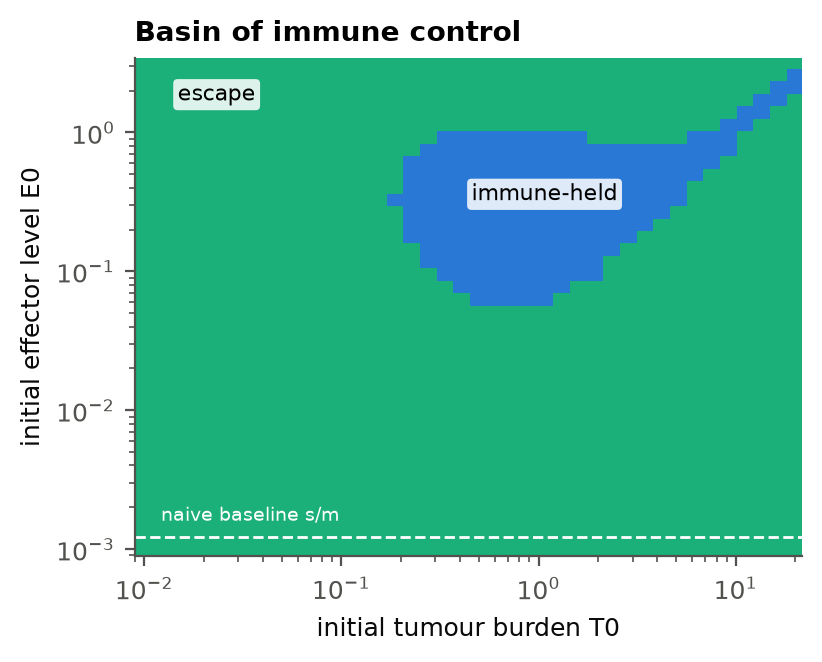
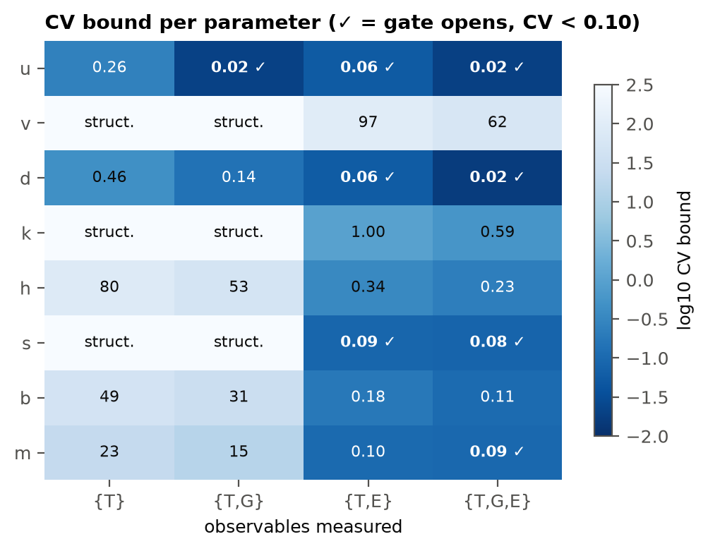
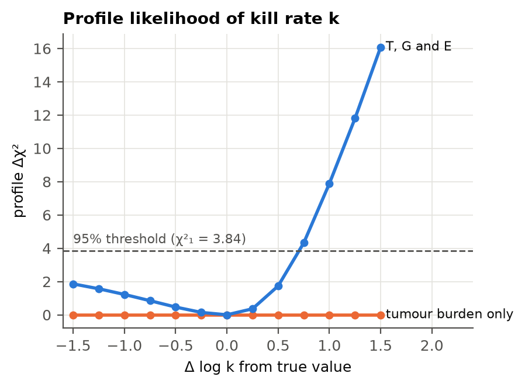
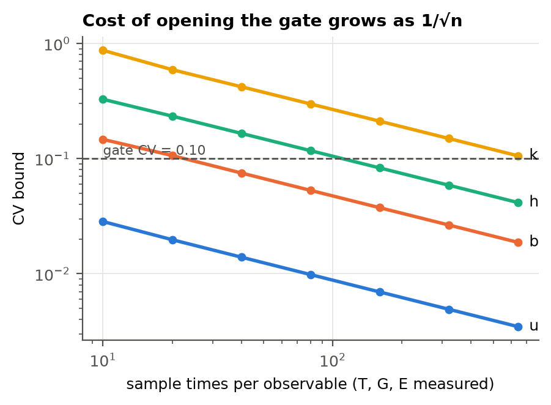

# Front matter {-}

**Thesis #3**

**Status.** Computational research thesis manuscript. It reports mathematical and numerical results on a dimensionless model. It is not a clinical study, not a medical device, not clinical decision support, not a dosing advisor, and not a claim of cure. It has not been peer reviewed.

**Relation to Thesis #2.** Thesis #2 built a research pipeline in which every CaseCard passes through an evidence gate that never opens, because *Knowledge ≠ Evidence ≠ Mechanism ≠ Parameter ≠ Prediction* [1]. It deferred one question to future work: what record would have to exist before a single parameter could be admitted? This thesis answers that question for one model and makes the answer executable.

**Reproducibility.** Every number and figure is produced by `python -m glucose_competition.analysis` in the repository `https://github.com/cloudynirvana/complexity-science`. Tests: `python -m pytest`. Raw outputs: `docs/manuscript/thesis_03_figures/results.json`.

\newpage

# Abstract {-}

**Problem.** Mechanistic models of tumour–immune interaction are routinely calibrated from tumour-size curves, and the fitted kill rates and expansion rates are then read as properties of the biology. Whether the available measurements can determine those parameters at all is rarely checked. Thesis #2 responded by refusing all parameterisation [1]. Refusal is safe but not productive. The problem addressed here is to replace a permanently closed gate with a **criterion**: a parameter may be admitted only if the declared experiment can identify it.

**Model.** A three-variable dimensionless model couples tumour burden *T*, effector T cells *E*, and a shared glucose pool *G*. Tumour growth and effector killing both draw on *G*, so tumour glucose uptake *u* represents metabolic competition of the kind reported experimentally by Chang et al. and Ho et al. [2,3].

**Dynamical results.** (i) The tumour-free state has a closed form, and its invasion exponent does not contain *u*: glucose competition cannot prevent or permit establishment. (ii) At a reference point the system is bistable between an immune-held equilibrium (*T* ≈ 0.78) and a glucose-depleted escape state (*T* ≈ 13.6). (iii) Along *u*, the immune-held state disappears in a fold at *u*\* ≈ 1.02; beyond it only escape remains. (iv) Raising *u* also *lowers* the escaped burden roughly as 1/*u*, because the tumour starves its own growth: competition switches control off without making the escaped tumour larger. (v) The basin of immune control is bounded on both sides in initial tumour size. Small seeds escape even with abundant effectors (immunological "sneaking through" [4]), and the naive effector baseline lies wholly outside the basin. (vi) Bistability is not generic. One of 400 random parameter draws produced it, and with weak antigen-driven expansion none of 120 grid points did.

**Identifiability results.** (vii) If only tumour burden is measured, the model has an exact one-parameter symmetry, *E* → *cE*, *v* → *v*/*c*, *k* → *k*/*c*, *s* → *cs*, that leaves the tumour trajectory unchanged to 4 × 10⁻¹⁰. The kill rate *k*, effector glucose uptake *v* and effector influx *s* are therefore **structurally** unidentifiable from tumour data, regardless of sample size or noise. (viii) With 20 samples at 5% noise, tumour-only data identify no parameter to a coefficient of variation below 0.10. (ix) Measuring effectors restores full rank. (x) Even with *T*, *G* and *E* all measured, *k* remains refused: its Fisher bound is 0.59, it needs about 700 sample times to fall below 0.10, and its profile likelihood has an upper 95% bound but **no lower bound** within a 4.5-fold reduction.

**Contribution.** A three-condition gate is specified and implemented: structural rank, Cramér–Rao bound, and a two-sided profile likelihood. Under it, the parameters everyone wants from tumour curves (the kill rate and the immune expansion rate) are the ones the gate refuses, and the parameter it opens first (*u*) is unlocked by measuring glucose, not by measuring the tumour more often. The general result is that **what may be known is fixed by what is measured**, so more data of the same kind cannot substitute for a different observable.

\newpage

# Keywords {-}

complexity science; organised complexity; tumour–immune dynamics; metabolic competition; glucose; bistability; fold bifurcation; immune equilibrium; sneaking through; structural identifiability; practical identifiability; Fisher information; profile likelihood; experimental design; evidence gate; computational research thesis

\newpage

# 1 Introduction

## 1.1 From a closed gate to a criterion

Complex pathology sits in Weaver's class of organised complexity: a modest number of coupled components whose interrelations matter [5]. Anderson's warning that new scales produce new laws applies to every attempt to move from a mechanism to a number [6]. Wolkenhauer argued that the purpose of a model is to make assumptions inspectable [7]. Aldridge and colleagues set out what a physicochemical model actually requires: a stated network and parameters calibrated on targeted experiments [8]. May warned that mathematics in biology is abused when the model is taken for the organism [9], and Saltelli and colleagues asked that models make their limits visible [10].

Thesis #2 turned those warnings into software. Its evidence gate refuses every attempt to turn a CaseCard, a review article, or a guideline into a rate constant [1]. That refusal is defensible but incomplete. A gate that can never open is a wall, and a research programme that only refuses will never measure anything. The next step is to state **what would open it**.

## 1.2 Metabolic competition as the test case

Proliferating cells, malignant and immune alike, depend on aerobic glycolysis [11]. Chang and colleagues showed in a mouse sarcoma model that tumour glucose consumption restricts T-cell glycolysis and IFN-γ production, and that increasing tumour glycolysis was enough to override T-cell control of a regressor tumour [2]. Ho and colleagues showed that phosphoenolpyruvate, a glycolytic metabolite, sustains T-cell receptor signalling, and that its scarcity in a glucose-poor microenvironment suppresses effector function [3]. Separately, immunoediting theory describes an *equilibrium* phase in which immunity restrains but does not clear a tumour [12], and Koebel and colleagues demonstrated such an equilibrium experimentally [13].

Those findings suggest a sharp hypothesis: glucose competition might act as a switch between immune-held equilibrium and escape. Mathematical tumour–immune models have long produced dormant states, sneaking through and bifurcations [4,14,15], and mathematical oncology increasingly asks such models to integrate with data [16,17]. Integration requires parameters, and parameters require identifiability [18–21].

## 1.3 Problem Statement

Mechanistic tumour–immune models are calibrated against tumour-size data, and their fitted parameters (kill rates, expansion rates, metabolic uptake) are reported as biological quantities without first establishing that the measurements could determine them. When a parameter cannot be determined, a fit still returns a number. That number reflects the optimiser's starting point and the noise rather than the biology. This is the *Parameter ≠ Evidence* failure that Thesis #2 identified [1], appearing in its most technical form.

The specific problem is threefold:

1. **No admission criterion.** There is no stated, executable rule in this research programme for when a model parameter may move from *refused* to *admitted*.
2. **Unknown dependence on the observable.** For metabolic tumour–immune models it is not established which parameters are identifiable from tumour burden alone, which need T-cell measurements, and which need glucose.
3. **Unknown dynamical role of competition.** It is not established, even in a minimal model, whether glucose competition acts as a switch (bistability with a fold) or merely as a dial on burden, or under what conditions each holds.

## 1.4 Justification of the Study

The study is justified first by necessity. Thesis #2's gate is closed by design, and a closed gate with no opening condition cannot support an experiment [1]. Identifiability analysis provides exactly the missing condition. Structural analysis asks whether perfect data could determine a parameter [20]. Practical analysis asks whether the actual data can [18,21]. Sloppiness analysis explains why many directions in parameter space are nearly invisible [19].

It is justified second by biology. Metabolic competition between tumour and T cells is experimentally established [2,3], immune equilibrium is experimentally established [13], and the obvious modelling move, adding a glucose term to a tumour–immune model, has not been checked for what it implies about switching or about measurability.

It is justified third by cost. Measuring tumour size is cheap. Measuring intratumoural effectors and glucose is not. If tumour data alone can never identify a kill rate, every fitted kill rate published from tumour curves alone is, at best, a statement about a combination of parameters. Knowing which observable to buy is a practical result.

## 1.5 Significance of the Study

**For complexity science.** The thesis gives a concrete instance of a general principle: in a coupled system the set of knowable parameters is fixed by the set of observed variables, and symmetry, not noise, sets the limit. More samples shrink practical uncertainty as 1/√*n*. They cannot remove a structural symmetry.

**For tumour–immune modelling.** It shows that, in this model class, the kill rate is structurally unidentifiable from tumour burden and practically unidentifiable even with full-state observation at realistic sampling. It also shows that glucose competition switches immune control *off* through a fold while making the escaped tumour *smaller*. That is a falsifiable prediction with a sign.

**For the research programme.** It converts Thesis #2's closed gate into an executable three-condition test (`glucose_competition/gate.py`). A parameter is admitted only for a declared experiment, and the same parameter can be open under one design and refused under another.

**What this significance is not.** No parameter here is fitted to data. No patient, cohort, or animal record is used. No dose, schedule, or treatment is implied. The model is dimensionless and minimal. The results are statements about a model and about what experiments could determine its parameters.

\newpage

# 2 Aims

**Aim 1 — Dynamics.** Characterise the equilibria, stability and regimes of a minimal glucose-competition model, and determine whether tumour glucose uptake acts as a switch or a dial.

**Aim 2 — Structure.** Determine which parameters are structurally identifiable from tumour burden alone, and which observable breaks any symmetry.

**Aim 3 — Practice.** Quantify practical identifiability under four observation sets, three experimental designs and seven sample sizes, and check the linear Fisher bounds with profile likelihoods.

**Aim 4 — Gate.** Specify and implement an executable evidence-gate rule, and report its verdict for each parameter under each design.

**Non-aims.** Fitting to experimental data; dimensional parameter values; treatment simulation; claims about any patient.

\newpage

# 3 Model

## 3.1 Equations

Let *G* be glucose in the tumour microenvironment, *T* tumour burden and *E* effector T cells, all dimensionless and non-negative. Glucose supply and washout are scaled to 1:

$$\frac{dG}{dt} = 1 - G - (uT + vE)\,\frac{G}{1+G}$$

$$\frac{dT}{dt} = T\left(\frac{G}{1+G} - d - kE\,\frac{G}{h+G}\right)$$

$$\frac{dE}{dt} = s + E\left(b\,\frac{G}{h+G}\,\frac{T}{1+T} - m\right)$$

| Symbol | Meaning |
| --- | --- |
| *u* | tumour glucose uptake (the competition parameter) |
| *v* | effector glucose uptake |
| *d* | tumour loss rate |
| *k* | effector kill rate, gated by effector fuel |
| *h* | half-saturation of effector glucose use (tumour half-saturation is 1) |
| *s* | effector influx |
| *b* | antigen-driven effector expansion, gated by fuel |
| *m* | effector loss |

## 3.2 Assumptions and what they encode

1. **A shared pool.** Tumour growth and effector function draw on the same *G* [2,3,11].
2. **Fuel-gated effector function.** Both killing and expansion scale with *G*/(*h*+*G*), so effectors whose half-saturation *h* exceeds the tumour's are the more glucose-sensitive population.
3. **Saturating antigen stimulation.** Expansion scales with *T*/(1+*T*), so a very small tumour stimulates little expansion [4].
4. **No space, no heterogeneity, no therapy.** These are deliberate omissions, and Section 7 states their cost.

## 3.3 Reference point

All dynamical and identifiability results are reported at one reference point: *u* = 0.685, *v* = 0.0886, *d* = 0.0958, *k* = 2.893, *h* = 1.584, *s* = 0.0011, *b* = 6.288, *m* = 0.894. It was not chosen to match data. It is the single draw, out of 400 log-uniform random draws in an exploratory sweep (`glucose_competition/regime_sweep.py`), that produced two stable states. Choosing it is a deliberate bias towards the interesting case, and Section 5.5 reports how rare that case is.

\newpage

# 4 Methods

## 4.1 Equilibria and stability

Equilibria were found by Newton iteration (MINPACK `hybrd` via SciPy [22]) from 80–200 random starts per parameter set, with *T* and *E* drawn log-uniformly over six and five decades. Roots were accepted if the residual norm was below 10⁻⁸ and all components were non-negative. Stability was read from the eigenvalues of a central-difference Jacobian. An equilibrium was called stable if every eigenvalue had real part below −10⁻⁹.

## 4.2 Regimes

A parameter set is classed as *clearance* (single stable state with *T* = 0), *immune-held* (single stable state with *E* above twice its tumour-free baseline *s*/*m*), *escape* (single stable state with *E* at or below that level), or *bistable* (two or more stable states). Regimes were mapped on 36 × 30 grids in (*u*, *h*) and (*u*, *b*) about the reference point. Stable states were traced along *u* at 60 log-spaced values, and the fold was located by bisection on the existence of the immune-held branch (25 halvings).

## 4.3 Basin of immune control

Trajectories were integrated (LSODA, relative tolerance 10⁻⁸) for 500 time units from *G*(0) = 1 on a 40 × 40 log grid of initial *T*(0) ∈ [0.01, 20] and *E*(0) ∈ [10⁻³, 3.2]. Each endpoint was classed by the same effector criterion as in 4.2.

## 4.4 Structural symmetry

Let *c* > 0. Under *E* → *cE*, *v* → *v*/*c*, *k* → *k*/*c*, *s* → *cs*, the products *vE* and *kE* are invariant, so the *G* and *T* equations are unchanged. The *E* equation is linear in *E* apart from the influx *s*, so it is mapped onto itself when *s* scales with *c*. The initial effector level *s*/*m* scales with *c* as well. Therefore *G*(*t*) and *T*(*t*) are identical for every *c*, while *E*(*t*) is multiplied by *c*. If *E* is not observed, the one-parameter family is indistinguishable. This was checked numerically for *c* ∈ {0.3, 3, 10}.

## 4.5 Practical identifiability (Fisher information)

A virtual experiment samples a declared subset of {*T*, *G*, *E*} at 20 equally spaced times on [2, 60], starting from *G* = 1, *T* = 0.05 and *E* = *s*/*m* (a naive host), with independent multiplicative noise of 5% (σ = 0.05 on the log scale). Sensitivities of log observations to log parameters were computed by central differences (relative step 10⁻⁴; integrator tolerance 10⁻¹⁰). The Fisher information is *F* = *S*ᵀ*S*/σ². The Cramér–Rao bound on the standard deviation of log θⱼ, which is approximately the coefficient of variation (CV) of θⱼ, is √(*F*⁻¹)ⱼⱼ. Rank was computed with a relative singular-value tolerance of 10⁻⁶, and any parameter loading on the null space was assigned an infinite bound. Three designs were compared: one seeding arm (*T*(0) = 0.05); three arms (*T*(0) ∈ {0.05, 1, 20}); and 10–640 sample times per observable.

## 4.6 Profile likelihood

Fisher bounds are local and symmetric. To check them, expected profile likelihoods were computed on noise-free synthetic data [18,21]. For each fixed value of the profiled log-parameter (13 values on ±1.5 log units), the other seven were refitted by trust-region least squares in log space from the true values. A parameter has a two-sided 95% interval if Δχ² exceeds 3.84 on both sides within the grid.

## 4.7 The gate rule

For a model, a parameter vector and a declared experiment (observables, times, noise, arms), each parameter receives one of four verdicts:

- `refused:structural` — it loads on the null space of the sensitivity matrix;
- `refused:practical` — its Fisher CV bound is ≥ 0.10;
- `refused:one_sided_profile` — its CV bound is < 0.10 but the profile does not cross 3.84 on both sides;
- `open` — all three conditions pass.

The threshold of 0.10 is a convention, and the code takes it as an argument. The verdict belongs to the experiment, not to the biology.

Figure 1 shows the procedure and, on the right, the verdict it returns for every parameter of the model in Section 3 under two measurement sets. The panel is generated from `results.json`, so it cannot drift from the computed results.

![**Figure 1.** The evidence gate. A parameter is admitted only for a declared experiment, and only if it passes all three tests: it must lie off the null space of the sensitivity matrix (structural), its Cramér–Rao coefficient-of-variation bound must fall below the stated threshold (practical), and its profile likelihood must cross the 95% level on both sides (shape). The right-hand panel gives the verdicts for the tumour / effector / glucose model: tumour counts alone admit nothing, and the kill rate *k* is refused under every design examined.](thesis_03_figures/fig1_workflow.png)

## 4.8 Software

Python ≥ 3.10, NumPy, SciPy (`solve_ivp` LSODA, `fsolve`, `least_squares`) [22], Matplotlib. The package `glucose_competition/` is separate from Thesis #2's `pathology_cases/` and `pipeline/`, which still import no numerical library. All seeds and grids are fixed. The full analysis takes about one minute on a laptop core, and the gate with profile confirmation takes about one minute per design. 40 automated tests cover non-negativity, equilibrium residuals, the closed-form tumour-free state, bistability at the reference point, the exact symmetry, the rank change when *E* is measured, and the gate's refusal of *k*.

\newpage

# 5 Results

## 5.1 Establishment does not depend on glucose competition

With *T* = 0, the effector equation gives *E*₀ = *s*/*m*, and the glucose equation reduces to *G*² + *vE*₀*G* − 1 = 0, so

$$G_0 = \tfrac12\left(-vE_0 + \sqrt{(vE_0)^2 + 4}\right).$$

The tumour-free state is invaded if and only if

$$\lambda = \frac{G_0}{1+G_0} - d - k\,\frac{s}{m}\,\frac{G_0}{h+G_0} > 0.$$

The tumour uptake parameter *u* does not appear in λ. In this model, glucose competition cannot decide whether a tumour establishes; it acts only after the tumour exists. At the reference point *G*₀ = 0.99995, *E*₀ = 0.0012 and λ = 0.403, so the tumour-free state is unstable.

## 5.2 Bistability between immune-held and escape states

At the reference point there are four non-negative equilibria:

| State | *G* | *T* | *E* | Leading eigenvalue(s) | Type |
| --- | ---: | ---: | ---: | --- | --- |
| tumour-free | 1.000 | 0 | 0.0012 | +0.403 | unstable |
| immune-held | 0.756 | 0.781 | 0.358 | −0.029 ± 0.347i | stable focus |
| saddle | 0.349 | 3.631 | 0.312 | +0.207 | unstable |
| escape | 0.106 | 13.57 | 0.0021 | −0.085 | stable node |

The immune-held state keeps glucose high and effectors active, and it resembles the equilibrium phase of immunoediting [12,13]. The escape state has depleted glucose by 89%, and its effectors sit at baseline. A saddle separates them.

## 5.3 Glucose competition is a switch for control, not a dial on burden

Along *u* (Figure 2a), the immune-held state exists from the lowest value tested (0.03) up to a fold at **u\* ≈ 1.02**. There it merges with the saddle and vanishes. Beyond the fold only escape remains. Competition therefore acts as a switch: it removes immune control abruptly, with hysteresis, the signature of a critical transition [23].

The escaped burden moves the other way. It is 310 at *u* = 0.03, 16.2 at *u* = 0.58, 8.9 just past the fold and 1.5 at *u* = 6.1. A more glycolytic tumour depletes the pool that feeds its own growth, so it settles lower. The immune-held burden rises only slightly, from 0.59 to about 1.0 at the fold. In this model, then, glucose competition does not make the tumour bigger. It removes the immune-held alternative. Any measurement of "more glycolysis, more tumour" would therefore falsify the model as stated.

In the (*u*, *h*) plane (Figure 2b), of 1,080 grid cells 408 are immune-held, 307 bistable and 365 escape. Bistability occupies a band of intermediate effector fuel sensitivity, *h* ≈ 0.7–4.5 at low *u*. Below it effectors are fuel-robust and hold the tumour. Above it they are fuel-starved and cannot. The band narrows as *u* rises. In (*u*, *b*) (Figure 2c) bistability needs strong antigen-driven expansion, *b* above about 3–4, and the immune-held regime appears alone only at *b* above about 12.

## 5.4 The basin of immune control is bounded on both sides

Even where the immune-held state exists, a trajectory reaches it only from a bounded region of initial conditions (Figure 3). Of 1,600 initial conditions, 202 (12.6%) end immune-held. Three features matter.

1. **The naive host escapes.** The tumour-free effector baseline *s*/*m* = 0.0012 lies wholly outside the basin. A tumour seeded into a naive host escapes at every tested size. Reaching immune control requires effectors primed roughly 50–800-fold above baseline (*E*(0) ≈ 0.06–1).
2. **Small seeds escape.** Below *T*(0) ≈ 0.2 every seed escapes, whatever the effector level. A small tumour stimulates too little expansion (*T*/(1+*T*) is small), effectors decay at rate *m* before the tumour grows, and the tumour then outgrows control. This is immunological sneaking through, previously reported in the Kuznetsov–Perelson model [4].
3. **Strong initial responses can also escape.** At *E*(0) = 1.6 and *T*(0) = 1–3, effectors drive the tumour down to *T* ≈ 0.07–0.10 within about four time units, against a minimum of 0.55 from a moderate start (*E*(0) = 0.4). Expansion then collapses with the antigen, effectors decay, and the remnant sneaks through to the escape state. Overshoot followed by sneaking through is a model prediction that, to our knowledge, has not been tested here or elsewhere. We flag it as a hypothesis, not a finding about biology.

## 5.5 Negative results and a correction

Three results did not support the hypotheses that motivated them, and they are reported here.

- **Bistability is not generic.** In a 400-draw random sweep over all eight parameters (log-uniform ranges in `regime_sweep.py`), one draw (0.25%) gave two stable states. With weak antigen-driven expansion (*b* = 1.2), a 120-point grid over *h* ∈ [0.5, 8], *k* ∈ [6, 25] and *u* ∈ [0.5, 40] produced no bistability at all. The outcome there was set entirely by the sign of λ, and *u* changed nothing but the burden.
- **Fuel asymmetry alone is not sufficient.** The hypothesis that escape needs effectors to be more glucose-sensitive than the tumour (*h* > 1) holds only where antigen-driven expansion is strong (Figure 2b–c). Without strong expansion, *h* has no switching role.
- **Correction of an exploratory claim.** An earlier, simulation-based classifier in this project's exploratory sweep reported sustained oscillations in about 4% of draws. On re-analysis with more root-finding starts, every flagged case had a stable equilibrium whose slowest mode decays with real part between about −0.002 and −0.06. Most were damped spirals, and the simulations had simply not finished their transients. No limit cycle was confirmed. The claim is withdrawn.

## 5.6 Tumour burden alone cannot identify the kill rate

The symmetry of Section 4.4 holds numerically to 4.3 × 10⁻¹⁰ in log *T* at *c* = 3, and log *E* shifts by exactly log *c* (deviation 3 × 10⁻⁹). The tumour-only sensitivity matrix has rank 7 of 8. The kill rate *k*, effector glucose uptake *v* and effector influx *s* load on the null direction, and their tumour-only profile likelihood is flat to numerical precision (Δχ² = 0.000 at all 13 points; Figure 5). The data can only fix combinations invariant under the symmetry, such as *k*·*s* and *v*·*s*.

The result is structural. No number of tumour measurements at any noise level determines *k*. A kill rate fitted to tumour curves alone in this model class is the optimiser's choice of *c*, not a measurement.

## 5.7 What each observable buys

| Parameter | {*T*} | {*T*, *G*} | {*T*, *E*} | {*T*, *G*, *E*} |
| --- | ---: | ---: | ---: | ---: |
| *u* | 0.26 | **0.020** | **0.057** | **0.020** |
| *v* | struct. | struct. | 97 | 62 |
| *d* | 0.46 | 0.14 | **0.057** | **0.017** |
| *k* | struct. | struct. | 1.00 | 0.59 |
| *h* | 80 | 53 | 0.34 | 0.23 |
| *s* | struct. | struct. | **0.087** | **0.080** |
| *b* | 49 | 31 | 0.18 | 0.11 |
| *m* | 23 | 15 | 0.10 | **0.093** |
| rank | 7/8 | 7/8 | 8/8 | 8/8 |

*Table 1. Fisher CV bounds, one arm, 20 sample times, 5% noise. Bold: CV < 0.10.*

Four features stand out:

1. **Tumour data alone identify nothing to 10%.** The best bound is *u* at 0.26.
2. **Measuring glucose**, not more tumour, is what opens *u* (0.26 → 0.020). This matches the biology: *u* is a statement about glucose.
3. **Measuring effectors** breaks the symmetry and opens *s*, the parameter it was entangled with.
4. **Effector glucose uptake *v* stays unidentifiable in every design** (CV ≥ 62). At the reference point effectors are a small glucose sink next to the tumour, so their uptake hardly perturbs anything observable. This is a sloppy direction in the sense of Gutenkunst et al. [19].

A three-arm design (seeding at *T*(0) = 0.05, 1 and 20) improves every finite bound, by factors from about 1.4 (*b* with *T* and *E* measured) to about 18 (*h* with *T* and *G* measured), but leaves the rank unchanged. Under tumour-only observation it brings *u* and *d* both to 0.093, just inside the threshold. Design can sharpen what the observables already allow. It cannot remove a symmetry.

## 5.8 The Fisher bound is optimistic for the kill rate

With all three states measured, the Fisher bound for *k* is 0.59, a symmetric interval. The profile likelihood (Figure 5) disagrees. It rises steeply above the true value and crosses the 95% threshold between +0.50 and +0.75 log units. Below the true value it rises only to Δχ² = 1.86 at a 4.5-fold reduction. So *k* has an upper bound and **no lower bound**. A fitted kill rate could be much smaller than the truth without the data objecting, but not much larger. This asymmetry is what the gate's third condition is there to catch.

## 5.9 The cost of opening the gate

Where a parameter is identifiable, its bound falls as 1/√*n* in the number of sample times (Figure 6). The cost to bring each parameter below 0.10 with *T*, *G* and *E* measured is:

- *u*: under 10 sample times;
- *b*: about 40;
- *h*: about 160;
- *k*: still 0.106 at 640, so about 700 sample times per observable.

For the kill rate that means over two thousand paired measurements of tumour, glucose and intratumoural effectors in one time course. The gate's verdict on *k* is therefore not "refused for now". It is "refused at any experimental scale that is realistic for a single in vivo time course".

## 5.10 Gate verdicts

| Parameter | {*T*} | {*T*, *G*} | {*T*, *E*} | {*T*, *G*, *E*} |
| --- | --- | --- | --- | --- |
| *u* | practical | **open** | **open** | **open** |
| *v* | structural | structural | practical | practical |
| *d* | practical | practical | **open** | **open** |
| *k* | structural | structural | practical | practical |
| *h* | practical | practical | practical | practical |
| *s* | structural | structural | **open** | **open** |
| *b* | practical | practical | practical | practical |
| *m* | practical | practical | practical | **open** |

*Table 2. Gate verdicts, one arm, 20 sample times, 5% noise, CV threshold 0.10. "open" requires the two-sided profile check. "practical" and "structural" are refusals.*

Under the cheapest experiment the gate opens nothing. Under the most expensive realistic one it opens four of eight parameters. The two parameters a modeller most wants from tumour curves, the kill rate *k* and the expansion rate *b*, are refused in every design.

\newpage

# 6 Discussion

## 6.1 The answer to Thesis #2's open question

Thesis #2 asked what record must exist before a parameter may be admitted [1]. For this model the answer is now specific. The record must declare its observables, sampling and noise. It must show that the parameter is off every structural null direction under those observables. It must show a Cramér–Rao bound below a stated threshold. And it must show a two-sided profile likelihood. The gate is no longer closed by decree. It is closed or open by computation, and the computation can be checked by anyone who runs the repository.

This preserves Thesis #2's boundary and gives it a door. *Knowledge ≠ Parameter* still holds: a review article supplies no Fisher information. But *Evidence → Parameter* is now a defined transition for a declared experiment, rather than a forbidden one.

## 6.2 Measurement fixes what can be known

Under tumour-only observation the symmetry *E* → *cE* is invisible, so *k*, *v* and *s* are fixed only up to *c*. That is not a defect of the fitting method, nor something more data or a better optimiser can fix. It is a property of the question, and it follows from the model's structure. Villaverde and colleagues showed that such unidentifiabilities are common and often missed [20]. Here the symmetry also has a biological reading: from the tumour's point of view, "many weak effectors" and "few strong effectors" are the same thing.

The constructive consequence is a ranking of what to buy:

1. **A glucose measurement** opens tumour uptake.
2. **An effector measurement** breaks the symmetry and opens influx and loss.
3. **The kill rate is not cheaply available.** It needs dense, multi-observable sampling, and even then a lower bound may not appear.

That ranking is the useful output of this work for anyone planning an experiment.

## 6.3 Competition as a switch

The dynamical results suggest a reading of the Chang and Ho experiments [2,3]. If glucose competition acts through a fold, a modest increase in tumour glycolysis can remove immune control abruptly, which is consistent with Chang and colleagues' observation that enhancing glycolysis overrode control of a regressor tumour [2]. The model also predicts that the tumour which escapes this way settles at a *lower* burden than a less glycolytic escaped tumour would, because it starves itself. That second prediction is the more falsifiable one, since a mechanism that only predicts "more competition, more tumour" cannot distinguish a switch from a dial. Near a fold, early-warning signals such as slowing recovery from perturbation are expected [23]. Whether they are measurable in tumour–immune time series is open.

## 6.4 Sneaking through and the naive host

The basin result shows that immune control in this model is not reached from a naive host. Small seeds sneak through [4], and only primed effectors land in the immune-held basin. This is consistent with immune equilibrium as an experimentally established but conditional state [13]. It also says that equilibrium, where it exists, is a property of the history as much as of the parameters. That is another reason why a parameter fitted from one time course should not be read as a property of the tumour.

## 6.5 Honesty about rarity

The bistable reference point was selected because it was bistable, and Section 5.5 reports how rare that is. The identifiability results do not depend on bistability: the symmetry of Section 4.4 holds for every parameter set, and the practical bounds would need recomputing elsewhere. Popper's demand that a claim name its own destruction applies to this thesis too [24]. Section 8 lists the observations that would falsify each claim.

\newpage

# 7 Limitations

- **Minimal model.** One glucose pool, one effector population, no space, no other nutrients (glutamine, lactate, oxygen), no regulatory cells, no exhaustion state, no therapy. Exclusion and stromal barriers, central in Thesis #2's seed cases [25], are absent.
- **Dimensionless and unfitted.** No parameter value corresponds to a measured quantity. The fold location *u*\* ≈ 1.02 means nothing in physical units.
- **Selected reference point.** Bistability holds in a minority of parameter space (Section 5.5). Practical bounds are reported at one point only.
- **Local methods.** Equilibria come from multi-start Newton iteration, which can miss roots. Fisher bounds are linearisations. Profiles are refitted from the true values and may miss distant optima. Folds were located by bisection, not by numerical continuation software.
- **Idealised experiment.** Noise is independent and log-normal at 5%. Real intratumoural glucose and effector measurements are invasive, sparse and correlated, so the stated sample counts are optimistic.
- **Threshold convention.** A CV of 0.10 is a convention, and other thresholds change the verdicts quantitatively, not qualitatively.
- **Single author, unreviewed.** This manuscript has not been peer reviewed.

\newpage

# 8 Future work and falsifiers

## 8.1 Falsifiers

| Claim | Would be falsified by |
| --- | --- |
| Establishment does not depend on *u* | tumour take rate in naive hosts changes with tumour glycolytic capacity alone |
| Competition switches control through a fold | a graded, non-hysteretic loss of control as tumour glycolysis is titrated |
| Escaped burden falls with *u* | escaped tumours with higher glycolytic capacity settling at higher burden |
| Tumour-only data cannot fix *k* | (mathematical; holds for this model by Section 4.4) a *different* model would be needed |
| Small naive seeds sneak through | small seeds controlled in naive hosts without priming |

## 8.2 Next steps

1. **Rigorous continuation.** Confirm the fold and map codimension-two points (cusp, Bogdanov–Takens) with continuation software rather than bisection.
2. **Global identifiability.** Apply a differential-algebra or Lie-derivative test [20] to confirm that the symmetry found here is the only one, and that no other combination is unidentifiable.
3. **Optimal design.** Choose sample times and seeding arms to maximise information on *k* and *b* specifically, and report the minimum cost.
4. **Richer models through the same gate.** Add exhaustion, a lactate pool, or a spatial term, and rerun the gate. Every added state is a new place for a symmetry to hide.
5. **Link to CaseCards.** Allow a Thesis #2 CaseCard to *point at* a gate decision file, without the CaseCard itself containing any number, so that the data layer stays clean [1,26].
6. **Real data, honestly labelled.** Any future fit to published time courses must ship its gate verdicts beside its estimates.

\newpage

# 9 Conclusions

A closed evidence gate is safe but sterile. This thesis replaces it, for one metabolic tumour–immune model, with a computable criterion. A parameter is admitted only if the declared measurements can identify it structurally, bound it practically, and bound it on both sides. Under that criterion tumour-size data identify nothing, the kill rate is structurally invisible to them, and even full-state observation leaves the kill rate refused at any realistic scale.

The dynamics give the criterion something to protect. Glucose competition does not decide establishment. It switches immune control off through a fold while making the escaped tumour smaller, and immune control is reachable only from primed hosts. Those are falsifiable statements with signs.

The general lesson is the one Thesis #2 started from, now with a mechanism: *Knowledge ≠ Evidence ≠ Mechanism ≠ Parameter ≠ Prediction* — and the step from Evidence to Parameter is decided by what is measured.

\newpage

# Data and code availability {-}

All code, outputs and figures are in `https://github.com/cloudynirvana/complexity-science` under the MIT licence. Reproduce with `python -m pip install -e ".[dev]"` then `python -m glucose_competition.analysis` and `python -m pytest`. Raw numerical outputs are in `docs/manuscript/thesis_03_figures/results.json`. In keeping with reproducible-research and FAIR practice [27,28], the manuscript Markdown is generated from a source file whose citation keys are resolved by `docs/manuscript/src/build_thesis_03.py`.

# References {-}

Vancouver / NLM (`docs/CITATION_STYLE.md`). Journal items were checked against PubMed MEDLINE records (authors, NLM abbreviation, volume, issue, pages, DOI, PMID) on 2 October 2026. No DOI was invented. Books carry no DOI.

1. Ogbonna KE. Complexity science and NSTG-guided in-silico pathology dynamics for biologics pathway exploration. Computational research thesis manuscript [Internet]. Complexity Science repository; 2026 Sep 20 (rev. 2026 Sep 21) [cited 2026 Oct 2]. Available from: https://github.com/cloudynirvana/complexity-science

2. Chang CH, Qiu J, O'Sullivan D, Buck MD, Noguchi T, Curtis JD, et al. Metabolic competition in the tumor microenvironment is a driver of cancer progression. Cell. 2015;162(6):1229-41. doi:10.1016/j.cell.2015.08.016. PMID: 26321679

3. Ho PC, Bihuniak JD, Macintyre AN, Staron M, Liu X, Amezquita R, et al. Phosphoenolpyruvate is a metabolic checkpoint of anti-tumor T cell responses. Cell. 2015;162(6):1217-28. doi:10.1016/j.cell.2015.08.012. PMID: 26321681

4. Kuznetsov VA, Makalkin IA, Taylor MA, Perelson AS. Nonlinear dynamics of immunogenic tumors: parameter estimation and global bifurcation analysis. Bull Math Biol. 1994;56(2):295-321. doi:10.1007/BF02460644. PMID: 8186756

5. Weaver W. Science and complexity. Am Sci. 1948;36(4):536-44. PMID: 18882675

6. Anderson PW. More is different. Science. 1972;177(4047):393-6. doi:10.1126/science.177.4047.393. PMID: 17796623

7. Wolkenhauer O. Why model? Front Physiol. 2014;5:21. doi:10.3389/fphys.2014.00021. PMID: 24478728

8. Aldridge BB, Burke JM, Lauffenburger DA, Sorger PK. Physicochemical modelling of cell signalling pathways. Nat Cell Biol. 2006;8(11):1195-203. doi:10.1038/ncb1497. PMID: 17060902

9. May RM. Uses and abuses of mathematics in biology. Science. 2004;303(5659):790-3. doi:10.1126/science.1094442. PMID: 14764866

10. Saltelli A, Bammer G, Bruno I, Charters E, Di Fiore M, Didier E, et al. Five ways to ensure that models serve society: a manifesto. Nature. 2020;582(7813):482-484. doi:10.1038/d41586-020-01812-9. PMID: 32581374

11. Vander Heiden MG, Cantley LC, Thompson CB. Understanding the Warburg effect: the metabolic requirements of cell proliferation. Science. 2009;324(5930):1029-33. doi:10.1126/science.1160809. PMID: 19460998

12. Dunn GP, Old LJ, Schreiber RD. The three Es of cancer immunoediting. Annu Rev Immunol. 2004;22:329-60. doi:10.1146/annurev.immunol.22.012703.104803. PMID: 15032581

13. Koebel CM, Vermi W, Swann JB, Zerafa N, Rodig SJ, Old LJ, et al. Adaptive immunity maintains occult cancer in an equilibrium state. Nature. 2007;450(7171):903-7. doi:10.1038/nature06309. PMID: 18026089

14. de Pillis LG, Radunskaya AE, Wiseman CL. A validated mathematical model of cell-mediated immune response to tumor growth. Cancer Res. 2005;65(17):7950-8. doi:10.1158/0008-5472.CAN-05-0564. PMID: 16140967

15. Eftimie R, Bramson JL, Earn DJ. Interactions between the immune system and cancer: a brief review of non-spatial mathematical models. Bull Math Biol. 2011;73(1):2-32. doi:10.1007/s11538-010-9526-3. PMID: 20225137

16. Altrock PM, Liu LL, Michor F. The mathematics of cancer: integrating quantitative models. Nat Rev Cancer. 2015;15(12):730-45. doi:10.1038/nrc4029. PMID: 26597528

17. Anderson AR, Quaranta V. Integrative mathematical oncology. Nat Rev Cancer. 2008;8(3):227-34. doi:10.1038/nrc2329. PMID: 18273038

18. Raue A, Kreutz C, Maiwald T, Bachmann J, Schilling M, Klingmüller U, et al. Structural and practical identifiability analysis of partially observed dynamical models by exploiting the profile likelihood. Bioinformatics. 2009;25(15):1923-9. doi:10.1093/bioinformatics/btp358. PMID: 19505944

19. Gutenkunst RN, Waterfall JJ, Casey FP, Brown KS, Myers CR, Sethna JP. Universally sloppy parameter sensitivities in systems biology models. PLoS Comput Biol. 2007;3(10):1871-78. doi:10.1371/journal.pcbi.0030189. PMID: 17922568

20. Villaverde AF, Barreiro A, Papachristodoulou A. Structural identifiability of dynamic systems biology models. PLoS Comput Biol. 2016;12(10):e1005153. doi:10.1371/journal.pcbi.1005153. PMID: 27792726

21. Simpson MJ, Baker RE, Vittadello ST, Maclaren OJ. Practical parameter identifiability for spatio-temporal models of cell invasion. J R Soc Interface. 2020;17(164):20200055. doi:10.1098/rsif.2020.0055. PMID: 32126193

22. Virtanen P, Gommers R, Oliphant TE, Haberland M, Reddy T, Cournapeau D, et al. SciPy 1.0: fundamental algorithms for scientific computing in Python. Nat Methods. 2020;17(3):261-272. doi:10.1038/s41592-019-0686-2. PMID: 32015543

23. Scheffer M, Bascompte J, Brock WA, Brovkin V, Carpenter SR, Dakos V, et al. Early-warning signals for critical transitions. Nature. 2009;461(7260):53-9. doi:10.1038/nature08227. PMID: 19727193

24. Popper KR. The logic of scientific discovery. London: Hutchinson; 1959.

25. Joyce JA, Fearon DT. T cell exclusion, immune privilege, and the tumor microenvironment. Science. 2015;348(6230):74-80. doi:10.1126/science.aaa6204. PMID: 25838376

26. Aguirre-Ghiso JA. Models, mechanisms and clinical evidence for cancer dormancy. Nat Rev Cancer. 2007;7(11):834-46. doi:10.1038/nrc2256. PMID: 17957189

27. Peng RD. Reproducible research in computational science. Science. 2011;334(6060):1226-7. doi:10.1126/science.1213847. PMID: 22144613

28. Wilkinson MD, Dumontier M, Aalbersberg IJ, Appleton G, Axton M, Baak A, et al. The FAIR Guiding Principles for scientific data management and stewardship. Sci Data. 2016;3:160018. doi:10.1038/sdata.2016.18. PMID: 26978244

# Disclaimer {-}

This is a computational research manuscript about a dimensionless mathematical model. It is **not** a medical device, **not** clinical decision support, **not** a dosing advisor, and **not** a cure. No patient, cohort or animal data were used. No parameter corresponds to a measured clinical or biological quantity. Nothing here recommends a treatment, dose, schedule or combination. If you are a patient or caregiver, consult a licensed clinician.
